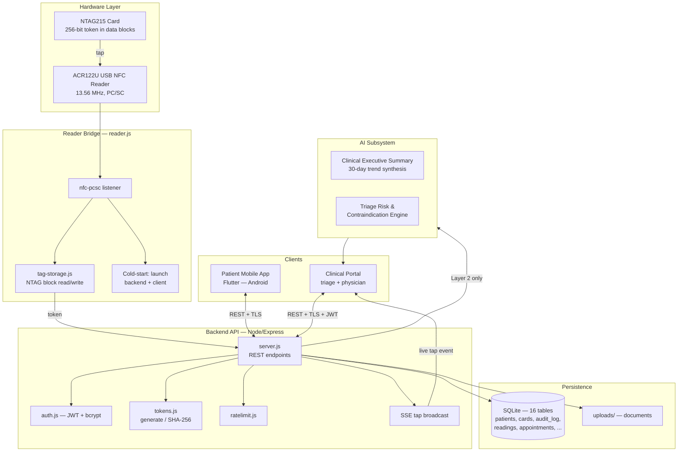
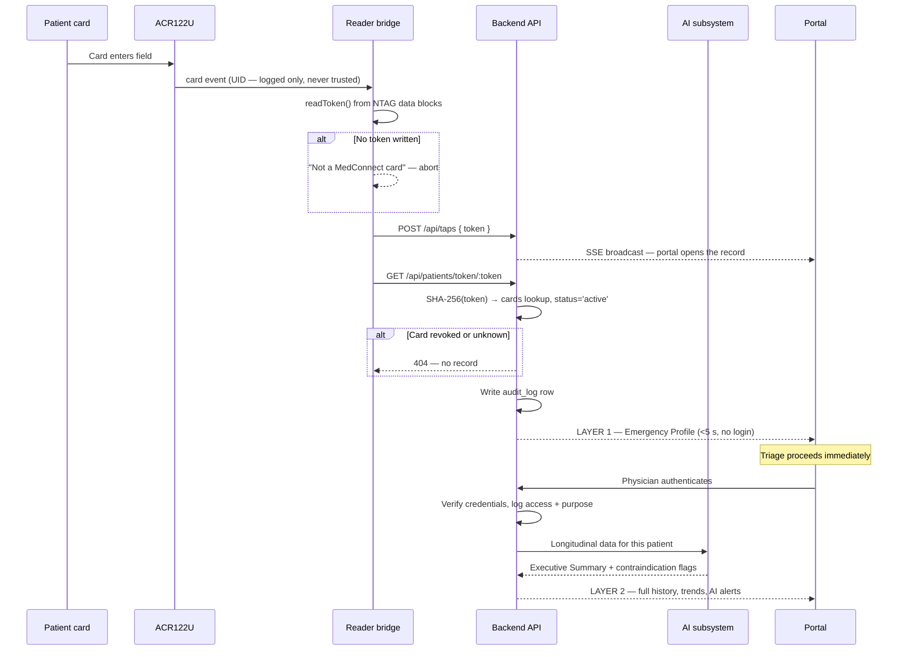
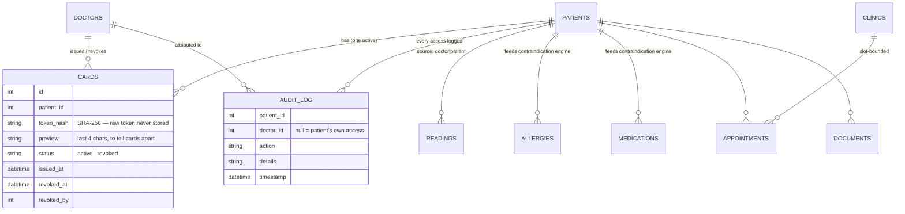

# NFC-MedConnect — Closing the Information Vacuum in the Golden Hour

**Project Nexus 2026: AI Innovation Challenge**
**Track 1 — Healthcare Technology**
**Phase 1 Technical Proposal · Submission deadline 16 August 2026**

| | |
|---|---|
| **Team name** | *[TEAM NAME]* |
| **Institution(s)** | *[e.g. Universiti Kebangsaan Malaysia / Multimedia University]* |
| **Team Lead** | *[Name, matric no., programme]* |
| **Members** | *[Name, matric no., programme]* × 1–3 |
| **WIE member** | *[Name]* — satisfies Handbook §1.3 |
| **Working repository** | `MedThru` *(internal codename; product name is NFC-MedConnect)* |
| **Contact** | *[email, phone]* |

---

## 1. Problem Identification

### 1.1 The Golden Hour and the information vacuum

In emergency medicine, the first 60 minutes — the "Golden Hour" — are critical to patient survival. When a patient arrives at an Emergency Department incapacitated, unconscious, or in severe distress, healthcare providers face an immediate, dangerous information vacuum. Valuable time is wasted attempting to identify the patient, look up medical histories, or interview frantic family members.

Three failures compound in those minutes:

- **Slow paperwork and registration.** Manual typing and searching for IDs takes up too much time when an emergency patient first arrives. This delays how quickly a doctor can see them.
- **The blind treatment risk.** Clinicians are forced to make split-second decisions without knowing critical baseline patient information: high-risk drug allergies (e.g. anaphylactic reactions to penicillin), active high-risk medications (e.g. blood thinners), or underlying chronic conditions (e.g. Type 1 diabetes).
- **Locked personal health data.** Millions of people track their health on their phones every day. But during a crisis, this helpful data stays locked behind a screen, completely useless to the emergency team.

### 1.2 The Malaysian context

The vacuum is structural, not incidental. Malaysian health records are fragmented across three disconnected estates: government facilities on the MOH system, private hospitals on their own vendor systems, and general practitioners on paper or standalone practice software. A patient who sees a GP in Kajang, is referred to a private specialist in Cheras, and then presents at HKL is represented by three unlinked records. There is no national patient-held summary that travels with the person.

The patients most affected are the ones least served by app-only solutions: elderly, rural, and lower-income patients — precisely those with the most complex histories, and the least likely to arrive holding a charged smartphone with an active data plan and a remembered password.

### 1.3 Why existing approaches do not close it

| Approach | Why it falls short |
|---|---|
| National EMR integration | Requires cross-institutional policy agreement and multi-year procurement. Real, but not deployable by a small team, and not deployable soon. |
| Smartphone health apps | Assume the patient is conscious, holds a charged phone, remembers a password, and has coverage. All four assumptions fail in exactly the emergency the system exists to serve. |
| Paper cards and medical-alert bracelets | Travel with the patient and work when unconscious — but hold a fixed handful of fields, go stale the day they are printed, and cannot be revoked when lost. |
| Cloud patient portals | Same conscious-and-authenticated assumption, plus a network dependency at the point of care. |

The gap is a record that is **physically carried, works without the patient's cooperation, stays current, and can be revoked** — the durability of a paper card with the freshness of a live database.

### 1.4 Tangible benefit if solved

Triage staff tap a card and the patient's identity auto-populates in under five seconds. The treating clinician sees blood type, severe allergies, active high-risk medications, chronic diagnoses, and emergency contacts immediately — with no login, no typing, and no patient cooperation required. Deeper history unlocks behind authenticated clinician credentials, with every access permanently logged.

Target for the prototype: **reduce time-to-critical-history from "minutes to hours, or never" to under five seconds**, on hardware costing under RM 200 per triage station and under RM 3 per patient card.

---

## 2. Target Users

The solution connects three groups to make emergency care fast and safe.

### User 1 — The Everyday Patient *(App & Card User)*

- **Who they are:** People with ongoing health issues (asthma, diabetes, heart conditions), elderly individuals, or anyone worried about emergencies.
- **What they need:** An easy way to track their health daily, and the peace of mind that their medical facts will "speak" for them if they are passed out or too shocked to talk.
- **Their biggest fear:** Being unable to speak during an accident and receiving a drug or treatment that causes a fatal allergic reaction.

### User 2 — The ER Check-in Staff & Triage Nurse *(Card Tapper)*

- **Who they are:** Front-desk hospital staff and nurses who handle fast, high-stress patient intake.
- **What they need:** A way to instantly confirm who the patient is and sign them into the hospital system without typing everything out by hand.
- **Their biggest problem:** Slow computer systems, manual data entry errors, and lost time searching for a patient's name during an emergency rush.

### User 3 — The ER Doctor & Specialist *(Portal User)*

- **Who they are:** Emergency room doctors and medical specialists who treat the patient.
- **What they need:** Direct access to an accurate, safe summary of the patient's health history and daily trends so they can give the right treatment safely.
- **Their biggest problem:** Having to guess a patient's medical history, or relying on the shaky memory of a stressed family member.

---

## 3. Proposed Solution — Conceptual Innovation

### 3.1 Ecosystem overview

We propose **NFC-MedConnect** — a fully integrated, tri-part emergency health platform. Rather than offering isolated mobile applications or relying on manual hospital intake procedures, NFC-MedConnect bridges the patient, front-desk triage staff, and treating emergency physicians into a unified digital framework.

Instead of building three separate, disconnected tools, the project combines a mobile app, a simple NFC card, and a hospital portal into one connected system. Each part works together to make emergency check-ins fast and safe.

**The Health App — collecting the data.** The patient's daily health companion, where users log vital signs, manage chronic conditions, and maintain an up-to-date medication list. Rather than forcing busy emergency doctors to scroll through hundreds of messy, raw numbers during a crisis, the app automatically organises daily logs into easy-to-read trend charts — clear patterns in blood pressure or heart rate over the last 30 days.

**The NFC Card — the quick key.** Tapping the card reads a secure, hidden code. It instantly skips the slow typing process by auto-populating the patient's basic profile on the hospital screen in under five seconds, eliminating intake bottlenecks and letting clinicians initiate care immediately.

**The Hospital Portal — keeping data safe and private.** The clinical surface where triage staff check patients in and physicians review history, governed by the dual-layer access model below.

### 3.2 The core design decision: the card carries a key, not the data

The obvious design — writing medical data onto the card — is the wrong one. It cannot be updated without recalling every card, it exposes the entire record to anyone who finds it, and a 1 KB NTAG cannot hold a real history anyway.

NFC-MedConnect writes a **256-bit cryptographically random token** into the card's user data blocks. The token is a bearer credential, not an identifier. On the server, only its SHA-256 hash is stored — the raw token leaves the system exactly once, at issue time, when it is written to a blank tag. This yields four properties simultaneously:

1. **Possession is the credential.** An unconscious patient authenticates by having the card in their wallet. No password, no phone, no consciousness required.
2. **The card never goes stale.** It holds a pointer; the record behind it is live.
3. **A lost card is containable.** Revoking it makes the token resolve to nothing. Reissue writes a fresh token to a new tag and marks the old one revoked, in a single transaction.
4. **A stolen card leaks nothing on its own.** The tag holds 32 random bytes. Without the backend they are meaningless.

### 3.3 The deliberate rejection of the hardware UID

Every NFC tag broadcasts a factory UID. It is tempting to use it as the patient identifier — it is free and already there. **NFC-MedConnect explicitly does not.** A UID is transmitted to any reader in range and is trivially cloned with a sub-RM-100 copier; using it as a credential would mean anyone who walks past a patient can later impersonate their card. The token is written into the tag's data blocks instead, and the reader bridge reads the UID only for logging.

This is the single most important security decision in the design, and it is already implemented in `reader.js` and `tag-storage.js`.

### 3.4 Dual-layer data access and privacy model

A central innovation of the platform is its dual-layer data architecture, balancing immediate, life-saving information access against strict patient medical privacy.

**Layer 1 — The Emergency Public Layer.** Accessible instantly on scanning the card, without physician authentication or passwords. To protect privacy while safeguarding life, this layer displays exclusively high-priority vital emergency data:

- Blood type
- Severe anaphylactic allergies (penicillin, latex, …)
- Active high-risk medications (blood thinners, …)
- Key chronic diagnoses (Type 1 diabetes, …)
- Emergency contacts

No passwords are required here, ensuring zero delays when saving a life.

**Layer 2 — The Sensitive Clinical Layer.** Protects deeper historical records, daily vital trends, and comprehensive diagnostic history. Access strictly requires authenticated clinician credentials via hospital single sign-on or encrypted login. Every access attempt generates an immutable audit log entry recording the clinician's credentials, timestamp, and purpose of lookup — full accountability, while giving attending specialists the deeper context complex procedures require.

**Implementation note.** The backend already realises this as four distinct resolution paths, all enforced server-side:

| Who presents | Resolves to | Proof required |
|---|---|---|
| First responder / triage | Layer 1 emergency subset | Card possession alone |
| Patient, own card | Layer 2 (own record) | Card possession, plus optional card password once opted in |
| Patient, no card on hand | Layer 2 (own record) | Phone + password, registered earlier while holding the card |
| Clinician | Layer 2, plus write access to clinical fields | Authenticated login (JWT bearer) |

Critically, **this is enforced in the API, not in the interface.** No client can grant itself access the server will not serve.

### 3.5 Clinical data verification

To ensure clinical reliability, the portal features a **clinician verification mechanism**. Primary care physicians can review and digitally stamp health parameters submitted by patients via the mobile app. Within the hospital portal, emergency staff can instantly distinguish between verified diagnosis entries approved by a licensed physician and self-reported patient inputs, significantly reducing diagnostic uncertainty in high-stress environments.

The data foundation for this is already built: every clinical row — readings, allergies, medications, lab results, documents — carries a `source` column set to `doctor` or `patient` by the server based on whether the request presented a valid clinician token. A self-measured blood-sugar reading is never silently promoted to a clinician-verified one. Phase 3 adds the explicit physician *verification stamp* on top of this attribution, so a patient-entered item can be promoted to verified by a named clinician at a recorded time.

---

## 4. AI Integration Strategy

### 4.1 On-system AI functionality

In accordance with Project Nexus 2026 rules (Handbook §6.1), artificial intelligence is embedded directly into the core functional workflow of the system, rather than being limited to document generation.

In an emergency setting, doctors do not have time to scroll through hundreds of historical data points or raw vital logs. NFC-MedConnect incorporates an embedded natural-language and time-series analytical engine that automatically evaluates the raw longitudinal health data collected by the mobile app.

**The Clinical Executive Summary.** The AI synthesises thirty-day vital trends into a concise, three-bullet summary, immediately highlighting clinically significant anomalies — hypertensive spikes, progressive glycaemic volatility, and similar patterns that are invisible in a raw table but obvious in aggregate.

**The Triage Risk & Contraindication System.** When an emergency physician accesses a patient profile, the AI cross-references documented drug allergies and active medications against standard emergency interventions. If a clinician selects a treatment plan posing a severe drug-interaction risk — administering anticoagulants to a patient already on high-dosage blood thinners, for instance — the system immediately generates a prominent, high-priority safety alert on the portal screen.

Both features consume data the platform already holds. The allergy, medication, and readings tables exist and are populated; the AI subsystem is the analytical layer over them.

**Clinical safety position.** These features are decision *support*, not decision *making*. Every alert is advisory, attributable, and shown alongside the underlying source data so the clinician can verify it. The system never withholds raw data in favour of a summary, and never blocks a clinical action — it surfaces a risk and records that it did so.

### 4.2 AI in the development workflow

Handbook §6.1 additionally requires AI integration at the level of prototype design, algorithm development, and testing. Our in-progress integration:

- **System architecture decisions** — the token-versus-UID analysis, the dual-layer access model, and the source-attribution scheme were developed through AI-assisted design review, with the team evaluating, challenging, and overriding proposals.
- **Firmware and protocol work** — NTAG21x data-block read/write sequencing, and PC/SC APDU handling against the ACR122U reader.
- **Security review** — adversarial analysis of the token lifecycle, rate-limit thresholds, and the card-loss threat model.
- **Test generation** — endpoint and access-scoping tests, including the "card A must never reach patient B's rows" class of test that guards every token-scoped route.
- **Debugging** — reader-level fault diagnosis once physical hardware enters the loop.

Every one of these — including the specific instances where the team identified and corrected AI errors — is recorded contemporaneously in the **Nexus Log** required by Handbook §6.3.

---

## 5. System Design & Architectural Framework

### 5.1 Architectural overview and data flow

The architecture follows a secure client-server topology: physical hardware components, cross-platform mobile interfaces, web-based clinical dashboards, and API backend services.

The operational sequence begins when a patient logs personal health information into the mobile application. The backend maps this data to the unique token assigned to the physical NFC card. On arrival at hospital, the card is tapped on a USB NFC reader attached to the triage terminal, transmitting the secure token via an encrypted API endpoint to the backend.

The backend verifies the token and returns the Layer 1 Emergency Profile without delay. If the attending physician requires a comprehensive view of historical trends, authenticating unlocks Layer 2, initiating the AI processing pipeline to generate real-time clinical summaries and contraindication checks. All transactional interactions between the mobile app, backend, and portal are secured using TLS.



### 5.2 The tap sequence



The cold-start path matters for the demo and for real deployment alike: a tap works from a completely cold terminal. The bridge starts the backend if it is not listening and opens the client if it is not running, so the operator's only action is presenting the card.

### 5.3 Technology stack

| System layer | Technologies used | Core function & role |
|---|---|---|
| **Hardware layer** | ACR122U USB NFC reader (13.56 MHz, PC/SC); NTAG215 cards | Physical patient identification; reads the stored token from the tag's data blocks |
| **Reader bridge** | Node.js, `nfc-pcsc`, custom NTAG block I/O | Detects taps, extracts the token, broadcasts to clients, cold-starts the stack |
| **Mobile client** | Flutter / Dart (Android; Windows desktop build for development) | Patient daily logging, trend charts, records, appointments, document upload |
| **Clinical portal** | Flutter desktop today → web portal (Phase 3 target) | Triage check-in and physician review across both access layers |
| **Backend API** | Node.js, Express 5, REST/JSON | Token resolution, access-layer enforcement, CRUD across the clinical record, audit logging |
| **Security** | bcrypt password hashing, JWT (separate patient and clinician tokens), SHA-256 token hashing, per-route rate limiting, TLS in transit | Authentication, credential protection, brute-force and enumeration resistance |
| **Database layer** | SQLite (16 tables); filesystem store for document blobs | Persistent clinical record, card lifecycle, immutable audit trail |
| **AI subsystem** | Time-series anomaly detection over the readings table; NLP summarisation for the Clinical Executive Summary; rule-plus-model contraindication cross-referencing | Converts raw longitudinal data into actionable clinical insight at the point of care |

### 5.4 Data model

Sixteen SQLite tables. The security-critical relationships:



Three properties fall out of this shape:

- **One active card per patient**, enforced at issue: reissuing revokes the previous card in the same transaction.
- **Every read and write is audited**, including patient self-access, and the patient can inspect their own audit trail.
- **Token-scoped routes are patient-scoped in SQL.** Every `/token/:token/...` endpoint resolves the patient first, then filters child rows by `patient_id`. Presenting one card cannot read, edit, or delete another patient's row even with a valid row ID. This is the most important invariant in the API and is enforced on every such route.

### 5.5 Security model

| Threat | Mitigation | Status |
|---|---|---|
| Cloned card via broadcast UID | UID never used as a credential; token lives in data blocks | Implemented |
| Token database leak | Only SHA-256 hashes stored; raw token returned once, at issue | Implemented |
| Card lost or stolen | Revoke/reissue; optional card password gates the full record on a raw tap | Implemented |
| Token enumeration | 256-bit token space + 30 lookups/min rate limit | Implemented |
| Clinician password guessing | bcrypt hashing + 20 attempts / 15 min | Implemented |
| Privilege escalation via client | Both access layers enforced server-side; the UI is not a security boundary | Implemented |
| Cross-patient data access | Every token-scoped query filtered by resolved `patient_id` | Implemented |
| Path traversal on document upload | Server-generated random stored filenames; `basename()` on read | Implemented |
| Unaudited access | Every read and write writes an `audit_log` row | Implemented |
| Hardcoded development JWT secret | Must be supplied via environment variable before any real patient data | **Open — pre-deployment blocker** |
| Data at rest unencrypted | Database-level encryption required for production | **Open — Phase 3 / post-competition** |

The final two rows are stated deliberately rather than omitted. They are known, tracked, and closed before the system touches real patient data.

### 5.6 Current implementation status

| Component | State |
|---|---|
| Backend API — `server.js` | ~1,750 lines; 16 tables; full CRUD across records, appointments, messaging, documents |
| Auth — `auth.js`, `tokens.js` | bcrypt; separate clinician and patient JWTs; card token generation and hashing |
| Reader bridge — `reader.js`, `tag-storage.js` | Written; PC/SC via `nfc-pcsc`; cold-start and SSE broadcast complete |
| Card provisioning — `write-card.js` | Written; writes a fresh token to a blank NTAG |
| Client — `app/` | 46 Dart source files; separate patient and clinician navigation; trend charts, PDF export, calendar export, notifications |
| Simulation harness — `simulate-tap.js` | Exercises the full tap path without hardware |
| Test suite — `test/smoke.js` | Endpoint and cross-patient scoping coverage |
| **AI subsystem** | **Designed, not yet built — primary Phase 3 software deliverable** |
| **Layer 1 emergency route** | **Specified; to be hardened and demonstrated in Phase 3** |
| **Physician verification stamp** | **Source attribution built; explicit stamp is Phase 3** |

The record-keeping platform is substantially built. **Phase 3 delivers three things: the physical hardware loop, the AI subsystem, and the Layer 1 emergency route.**

---

## 6. Integration Strategy

### 6.1 An overlay, not a replacement

NFC-MedConnect is designed to sit alongside existing hospital systems, not replace them. It does not ask a facility to migrate off its EMR. A participating facility adds one USB reader per triage station; the card becomes a patient-held index that works across facilities which would otherwise never exchange data. Nothing about a hospital's existing system has to change for a card to be readable there.

### 6.2 Deployment path

| Stage | Scope | What it proves |
|---|---|---|
| **1. Single clinic** | One reader at reception, one at the consultation desk; cards issued at registration | Tap-to-record works in a real workflow with real staff |
| **2. Clinic cluster** | Several GP clinics sharing one backend | Cross-facility continuity — the actual point of the system |
| **3. Emergency department** | Readers at triage; Layer 1 only at the front desk | The unconscious-patient case: the highest-value scenario |
| **4. Standards alignment** | HL7 FHIR export/import over the existing schema | A path into national infrastructure rather than a competing silo |

### 6.3 Cost of adoption

| Item | Unit cost | Note |
|---|---|---|
| ACR122U reader | ~RM 120–180 | One per triage station; a five-year asset |
| NTAG215 card | ~RM 2–3 | One per patient |
| Server | Commodity PC or hospital VM | SQLite; no licensing cost |
| Staff training | Under 30 minutes | The clinician-facing gesture is "tap the card" |

A single-doctor clinic can adopt for under RM 200 plus RM 3 per patient. This is the point of the architecture: the barrier to a patient-held national record has been organisational and financial rather than technical, so the design attacks cost and integration burden directly.

### 6.4 Regulatory position

Malaysia's **Personal Data Protection Act 2010** governs the health data held here. The architecture aligns by construction: data minimisation on the card itself (32 random bytes, nothing personal), an audit trail the data subject can inspect, patient-controlled revocation, and server-side access limits. Production deployment additionally requires encryption at rest, TLS in transit, a data controller agreement per facility, and MOH engagement for any public-sector pilot. These are named as known obligations, not solved problems.

A specific ethical note on Layer 1: making emergency data readable on possession alone is a deliberate trade of privacy for survivability, scoped to the minimum set of fields that change immediate treatment. Patients opt in at card issue, may set a card password that gates everything beyond Layer 1, and can revoke at any time.

---

## 7. Build Plan

Aligned to the official competition timeline: Phase 2 workshops and funding (19 August – 15 September 2026), Phase 3 build and mentorship (16 – 30 September 2026), Phase 3 submission (7 October 2026), and the Grand Finale at Multimedia University, Cyberjaya (17 October 2026).

### 7.1 Seed grant allocation — RM 700

Per Handbook §4.1, funds are for prototype hardware only, receipts submitted as a separate PDF, and any remainder returned to the Treasurer.

| Item | Qty | Est. cost (RM) |
|---|---|---|
| ACR122U USB NFC reader | 2 | 300 |
| NTAG215 blank cards | 50 | 150 |
| Card printing / patient-facing finish | 50 | 80 |
| Demo stand, cabling, powered USB hub | 1 set | 90 |
| Spare reader contingency | — | 80 |
| **Total** | | **700** |

A second reader is not redundancy for its own sake: it lets the booth demonstrate the tri-part flow live — tap at the "triage desk", walk to the "physician terminal", authenticate, and watch Layer 2 and the AI summary open on the same patient.

### 7.2 Schedule

| Window | Deliverable | Success criterion |
|---|---|---|
| **Now – 16 Aug** | **Phase 1 submission** — this proposal plus the 3-minute pitch video | Both components submitted; incomplete submissions are not evaluated |
| **19 Aug – 15 Sep** | **Phase 2** — workshops; top 30 announced; RM 700 seed grant received. Order readers and cards on disbursement; specify AI subsystem interfaces | Hardware in hand before the build window opens; receipts filed as purchased |
| **16 – 22 Sep** | Hardware loop closed end to end | Cold-boot tap: physical card → reader → Layer 1 profile on screen, <5 s, unattended |
| **16 – 23 Sep** | **Mentorship session 1** — clinical validity and deployment realism | Feedback captured and folded into the build |
| **18 – 25 Sep** | AI subsystem: Clinical Executive Summary over 30-day readings | Three-bullet summary generated from real logged data, with anomalies correctly surfaced |
| **23 – 28 Sep** | AI subsystem: contraindication engine; Layer 1 route hardening; card-loss flow | Anticoagulant-on-blood-thinner scenario raises a visible alert. Revoke → tap → correctly denied |
| **23 – 30 Sep** | **Mentorship session 2** — technical review | Feedback captured |
| **26 – 30 Sep** | Booth build; demo script; 50 cards provisioned and labelled | Full demo runs three times consecutively without operator intervention |
| **30 Sep – 5 Oct** | Documentation, system diagrams, Nexus Log completion | All required Phase 3 artefacts drafted |
| **5 – 6 Oct** | Final video; full submission dry run | Video demonstrates the *working* prototype, not slides |
| **7 Oct** | **Phase 3 submission — finalised proposal and video** | Submitted with ≥24 h margin |
| **17 Oct** | **Grand Finale** — MMU Cyberjaya; booth demonstration and final pitch | Live prototype performs its core function on demand |

### 7.3 Risk register

| Risk | Impact | Mitigation |
|---|---|---|
| Reader fails or arrives late | Fatal — §5.1 requires a physical working prototype | Two readers purchased; `simulate-tap.js` proves the software path independently, isolating hardware risk to the final link |
| NTAG write incompatibility | Cards unusable | NTAG215 chosen for `nfc-pcsc` support; test one card before provisioning fifty |
| AI subsystem overruns | Weakens the mandatory AI-integration requirement | Executive Summary first (higher demo value, simpler); contraindication engine second. A rule-based contraindication fallback ships if the model layer slips |
| Live demo failure at the booth | Disqualification ground under §10.1(3) | Rehearse three consecutive clean runs; carry spare reader, spare cards, and a pre-provisioned laptop |
| Windows PC/SC driver conflict | Reader not detected | Test on a second machine during the build window, not on finale day |
| Scope creep into new app features | Hardware and AI both slip | Feature freeze on the existing client from 16 Sep; build-phase effort goes to hardware, AI, and hardening only |

---

## 8. Improvement Plan

### 8.1 Immediate post-competition

- **Close the JWT secret gap** and add encryption at rest; complete a pre-deployment security review.
- **Web portal** to replace the desktop clinical client, removing per-terminal installation from hospital IT's workload.
- **HL7 FHIR export** over the existing schema, making records portable into standard infrastructure.
- **Offline-first clinic cache** so a facility keeps functioning through an internet outage — critical in rural deployment.
- **iOS build** — blocked by toolchain, not architecture; the Flutter codebase is already cross-platform.

### 8.2 Medium term

- **Phone-as-reader.** Android NFC makes any clinician's phone a reader, dropping per-station hardware cost to zero and removing the last capital barrier to adoption.
- **Hospital SSO integration** so clinician identity comes from the facility's existing directory rather than a separate credential.
- **Expanded AI** — triage acuity scoring at check-in, and deterioration prediction from longitudinal trends.
- **Multi-tenant backend** so a cluster shares infrastructure without sharing a database.

### 8.3 Long term

- **Facility federation** — participating hospitals resolve a card against a shared directory while each retains custody of its own records.
- **MOH pilot** in a Klinik Kesihatan or public ED — the deployment that would genuinely validate the national-scale claim.
- **Longitudinal population insight** from consented, de-identified aggregate data.

### 8.4 What would tell us it is working

Not downloads. Four measures: **time from patient arrival to identity confirmed at triage**; **time to critical-history availability**; **clinician-reported confidence in the AI summary against the underlying record**; and **proportion of issued cards still active at 12 months** — the last being the honest test of whether patients actually carry it.

---

## 9. Team Diversity

*[Complete before submission — 10% of the Phase 1 score, and WIE Diversity Credits are applied in this section.]*

| Member | Gender | Institution | Faculty / Programme | Role |
|---|---|---|---|---|
| *[Name]* | | | | Team Lead |
| *[Name]* | | | | |
| *[Name]* | | | | |
| *[Name]* | | | | |

- Female representation: *[n of m]* — Handbook §1.3 requires at least one. **50% or a female Team Lead earns bonus Diversity Credits and unlocks WIE mentor access.**
- Institutional diversity: *[note if members span more than one university]*
- Faculty diversity: *[note if members span more than one faculty]*

---

## 10. Summary

When an incapacitated patient arrives at an emergency department, the information needed to treat them safely almost always exists — it is simply unreachable in the first ten minutes. NFC-MedConnect closes that gap with a tri-part platform: a mobile app where patients log daily health data, an NFC card carrying a revocable cryptographic token rather than the data itself, and a clinical portal governed by a dual-layer access model — life-saving essentials on possession alone, full history behind authenticated clinician credentials, every access permanently logged. An embedded AI subsystem turns thirty days of raw vitals into a three-bullet clinical summary and cross-references allergies and active medications against proposed interventions to raise contraindication alerts at the point of decision.

The record platform is substantially built: a ~1,750-line Node/Express API over 16 SQLite tables with full audit logging, a 46-file Flutter client, and a written PC/SC reader bridge. The build phase delivers the remaining three pieces — the physical card-to-reader loop, the AI subsystem, and the Layer 1 emergency route — as a working hardware prototype, at an adoption cost under RM 200 per triage station and under RM 3 per patient.

---

### Appendix A — Codebase Structure

The existing implementation, as described in §5.6. Source will be pushed to the
committee-assigned GitHub repository at the Phase 3 submission on 7 October 2026.

```
MedThru/
├── server.js           REST API — 16 tables, full record + appointment surface
├── db.js               Schema and migrations
├── auth.js             bcrypt; clinician and patient JWTs
├── tokens.js           Card token generation, SHA-256 hashing, preview
├── ratelimit.js        Lookup and login throttling
├── reader.js           ACR122U bridge — tap → broadcast → lookup → launch
├── tag-storage.js      NTAG data-block read/write
├── write-card.js       Provision a blank tag with a fresh token
├── simulate-tap.js     Hardware-free tap simulation
├── test/smoke.js       Endpoint and cross-patient scoping tests
└── app/                Flutter client — 46 Dart sources, Android + Windows
```

### Appendix B — Nexus Log

Maintained continuously per Handbook §6.3 and submitted with the Phase 3 final submission. Records AI use in workflow coordination and design decisions, specific instances where the team identified and corrected AI errors, and a comparative analysis of the AI-assisted prototype against the original concept.
